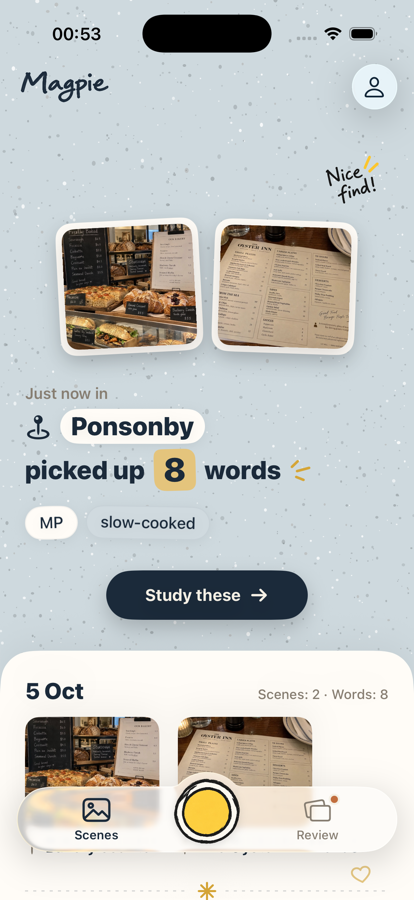
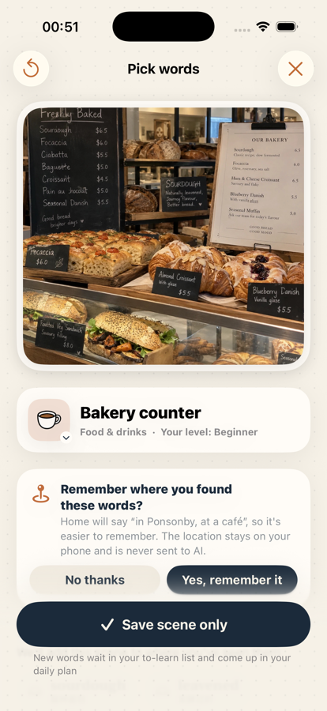
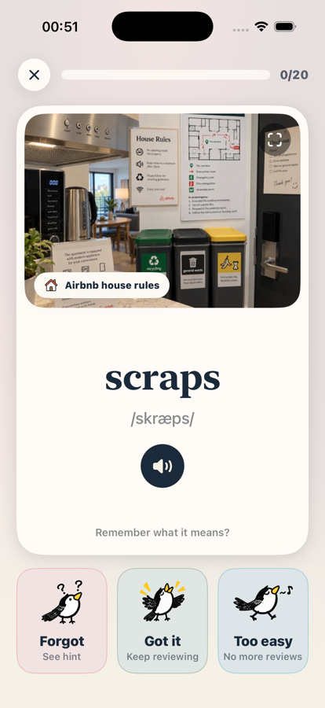
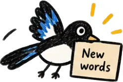
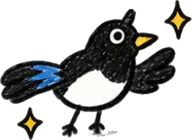
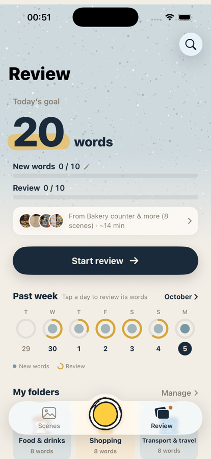
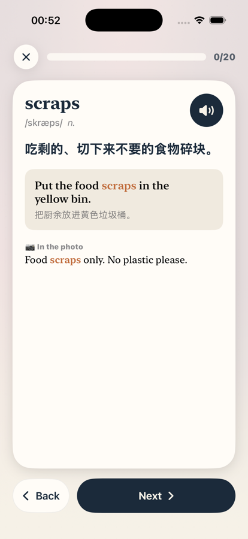
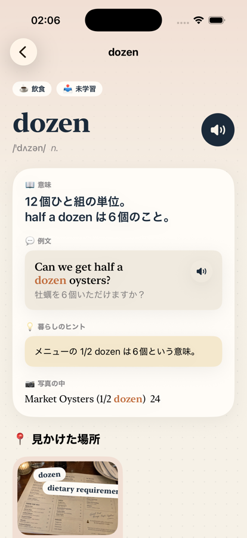
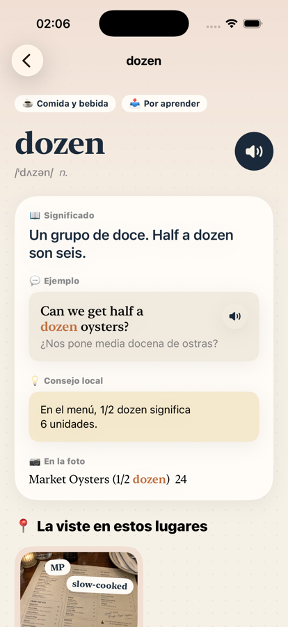

<p align="center">
  
</p>

<h1 align="center">Magpie</h1>

<p align="center"><strong>Pick up words as you go.</strong><br>
An iOS app that turns the English you run into in real life — menus, signs, bills, house rules — into a small daily review.</p>

<p align="center">
  <a href="https://youtu.be/sSIMpD1HA24"></a><br>
  <a href="https://youtu.be/sSIMpD1HA24">▶ Watch the 1‑minute promo</a>
</p>

<p align="center">
  
  &nbsp;&nbsp;
  
  &nbsp;&nbsp;
  
</p>

> Project name in Xcode is still `SnapLingo`; the product name is **Magpie**.

---

## Why Magpie

Textbooks hand you word lists sorted by topic. Real life doesn't.
Some days you meet eight words you want to know — on a café blackboard, a bus timetable, a recycling bin — and a week later both the word and *where you saw it* are gone.

Magpie keeps the two together. You snap a photo, it finds the words worth learning for your level, and it stores them with the photo and the place. Later, the word comes back on a flashcard sitting on top of the same picture.

<p align="center">
  
  &nbsp;&nbsp;&nbsp;
  
  &nbsp;&nbsp;&nbsp;
  
</p>

## How it works

### 1. Snap a scene

Point the camera at any English text, or pick a photo from your library. Vision OCR reads every line and records where each word sits in the image.

### 2. Pick the words worth learning

Claude looks at the recognised text and returns a short list of candidates, each tagged with a CEFR level (A1–C2), plus a scene title such as *Bakery counter* and one of 12 scene categories (food & drinks, shopping, transport, signage, housing, …). Words are grouped by how useful they are for **you**:

| Group | Meaning |
| --- | --- |
| Recommended | Between your level and one level above — the sweet spot |
| Harder | Above that; shown but unchecked |
| Probably know | Below your level, or you marked it known before |
| Already saved | In your library from an earlier scene |

Untick a recommendation and the app nudges your level estimate down a little; tick a "harder" word and it nudges up. You can also tap any word directly on the photo if the AI missed it.

If you took the photo with the camera, Magpie can remember the neighbourhood (*Ponsonby*, *Fitzroy*). It asks once, explains why, and the location never leaves the phone.

### 3. Review a few minutes a day

<p align="center">
  
  &nbsp;&nbsp;
  
  &nbsp;&nbsp;
  
</p>

The Review tab builds a daily plan: new words you saved recently plus whatever is due. The scheduler is **FSRS‑6** (default parameters), targeting 90 % retention; a word with an interval of 21 days or more counts as mastered.

Each card has three buttons — *Forgot*, *Got it*, *Too easy*. The back shows a definition in your native language, an example sentence with translation, a "life tip" where it helps (*"½ dozen on a menu means six"*), and the exact line from the photo the word came from. Every word page also lists the places you've seen it.

## Features

- **Photo → words.** On‑device OCR with Vision; Claude picks candidates, names the scene, and writes explanations.
- **Level‑aware.** A 30‑second adaptive "tap the words you know" test sets your CEFR level at onboarding; every save and review keeps adjusting it.
- **Daily plan.** Separate targets for new words and reviews, a past‑week ring chart, and a month calendar you can tap to replay any day's words.
- **Mistakes practice.** Words you forgot recently are collected into a quick re‑drill.
- **Folders.** Your own named folders with icons; a word can live in several without duplicating its review progress.
- **Scenes.** Every photo is kept as a scene with its title, category, shop name and neighbourhood. Delete a scene and words that only came from it go with it.
- **Pronunciation.** System speech with a choice of accents, for the word and the example sentence.
- **Search, Spotlight and Shortcuts.** Inline library search; words are indexed in Spotlight; "Start today's review" and "Snap a scene" are available to Siri and the Shortcuts app.
- **Reminders.** Optional daily study notification at a time you choose.
- **Export.** Whole library as CSV (UTF‑8 with BOM) that opens in Excel, Numbers or Anki.
- **Themes.** Five colour palettes (sky, sand, lilac, sage, blush) for the hand‑drawn home screen.

## Seven languages

The interface and all AI‑written explanations follow your native language: English, 简体中文, 繁體中文, 日本語, 한국어, Español, Português (Brasil).

<p align="center">
  
  &nbsp;&nbsp;
  
  &nbsp;&nbsp;
  
</p>

## Privacy

- Nothing is sent to the AI until you say yes. The consent prompt appears after your first photo, not during onboarding, and can be changed any time in *Me*.
- Only the **recognised text** goes to Claude. Photos, locations and your library stay on the device.
- Location is requested only for camera shots, only after an in‑app explanation, and is stored locally.
- There is no account and no backend. All data lives in SwiftData on your phone.

## Under the hood

| Layer | Choice |
| --- | --- |
| UI | SwiftUI, iOS 26, hand‑drawn brand assets over native system components |
| Storage | SwiftData (`VocabWord`, `Scan`, `ReviewLog`, `WordFolder`, `UserSettings`) |
| OCR | Vision `VNRecognizeTextRequest`, with per‑word bounding boxes |
| AI | Claude Messages API with JSON‑schema structured output; `claude-haiku-4-5` for the latency‑sensitive scan step |
| Scheduling | FSRS‑6 (`SpacedRepetitionService`), pure value types so it is fully unit‑tested |
| Level model | CEFR score 0–100 with monotone (pool‑adjacent‑violators) smoothing over the self‑test |
| Location | CoreLocation + MapKit reverse geocoding for the neighbourhood name |
| System integration | App Intents, Core Spotlight, UserNotifications, AVSpeechSynthesizer |
| Localisation | String Catalog (`Localizable.xcstrings`), source language zh‑Hans |

### Project layout

```
SnapLingo/
├── Models/          SwiftData models, CEFRLevel, SceneType, NativeLanguage
├── Services/        OCR, Claude API, FSRS scheduler, DailyPlanner, LevelTest,
│                    PlaceLocator, SpotlightIndexer, AppShortcuts, WordLibrary
├── ViewModels/      AppCoordinator (tabs, scan flow, deep links)
├── Views/           Home · Scan · Review · Study · Words · Folders · Me · Onboarding
├── DesignSystem/    Theme, shared components, empty states
├── Utilities/       Token matching, image helpers, CSV export, demo data
└── Assets.xcassets  Hand‑drawn magpie artwork and scene icons
SnapLingoTests/      Swift Testing suites for scheduling, planning, levels, folders, home, me
Parked/              Features set aside during the 2026‑09 redesign (not compiled)
```

## Getting started

Requirements: Xcode 26.2 or newer, an iPhone or simulator on iOS 26.2+, and a Claude API key for the AI features.

1. Clone the repo and open `SnapLingo.xcodeproj`.
2. Create `SnapLingo/APIConfig.swift` (it is git‑ignored):

   ```swift
   import Foundation

   enum APIConfig {
       static let claudeAPIKey = "sk-ant-…"
   }
   ```

3. Build and run the `SnapLingo` scheme.

Without a key the app still scans and lets you tap words on the photo; AI word picking and explanations are disabled.

### Handy launch arguments

| Argument | Effect |
| --- | --- |
| `-onboardingStep level` | Start onboarding at a given step (`welcome`, `intro`, `login`, `level`, `language`) |
| `-previewAccounts` | Show the sign‑in screens with a fake code service |
| `-loginPage phone` | Open a specific sign‑in page (`phone`, `email`, `code`) |

### Tests

```bash
xcodebuild test -scheme SnapLingo -destination 'platform=iOS Simulator,name=iPhone 17 Pro'
```

Around 90 Swift Testing cases cover the FSRS scheduler, the daily planner, level estimation, folders, home‑screen copy and the Me stats.

## Status and roadmap

Magpie is an active portfolio project. Done: the core loop, level model, FSRS review, folders, mistakes practice, Spotlight and Shortcuts, seven languages.

Next up:

- Sign in with phone / email / Apple once an account service exists (UI is built, gated behind `AccountFeatures.isEnabled`)
- iCloud sync via SwiftData + CloudKit
- Bringing back shareable word books from `Parked/` once there is a backend to share through

## Credits

Magpie illustrations are hand‑drawn for this project. Spaced repetition follows the open [FSRS](https://github.com/open-spaced-repetition/fsrs4anki/wiki/The-Algorithm) algorithm.
